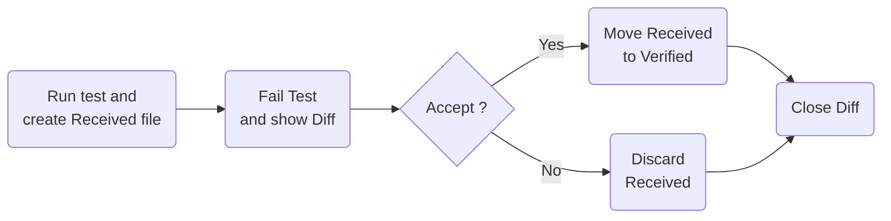
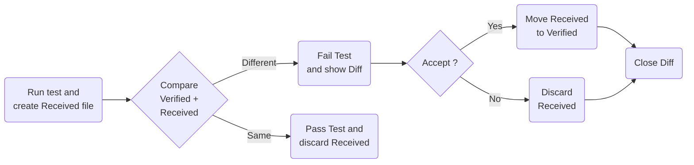

# Revitalizing Legacy Code
# Approval Testing Unleashed

#### Erfahrungen aus der Legacy-App-Portierung und 
#### Einblicke in die Welt von Verify

Patrick Drechsler

---

# Legacy-Context: Domain

- Expertensystem
- User: Ingenieure im Vertrieb
- Besonderheiten:
  - SI-Einheiten
  - Fließkommazahlen
  - Mathematik
    - nicht nur Dreisatz
    - komplexe Formeln (inkl. Integralrechnung)
    - sehr viele Formeln (x * 10^3 LoC)
    - Mathematik ist Core-Domain!

---

# Legacy-Context: Tech-Stack(s)

- Main Stack: LAMP
  - Linux
  - Apache
  - MySQL
  - PHP
  - PLUS: Angular 1
- Other Stacks
  - C++
  - MATLAB

---

# Legacy-Context: Architecture

- Frontend (FE): Angular
- Backend (BE): PHP
- Bonus: Weiteres externes System hat auch via BE & FE Daten abgerufen
  - Lassen wir erstmal außen vor

---

# Find a "seam"

- what is a seam? 👉 M. Feathers "Working Effectively with Legacy Code"
- Example: Redirecting a php request to a new dotnet console application
  ```php
  // Seam which toggles between PHP and .NET
  if ($this->useDotNet) {
    // C# calculation (new)
    return $this->calcDotNet("calculate", $request);
  }
  else {
    // PHP calculation (legacy)
    return new CalcWithPhp($request);
  }

  function calcDotNet($endpointName, Request $request)
  {
    // ...
    $encodedJson = base64_encode($request->getContent());
    $result = shell_exec("".$dotnetProgramm." ".$endpointName."  ".$encodedJson."");
    return $result;
  }
  ```

---

# Code von PHP nach C# portieren

- sehr viel Tipparbeit
- sehr viel über Fließkommazahlen lernen
- Umstruktierung / Refactoring:
  - Ich war nicht einverstanden mit gewissen Entscheidungen im Altsystem (meiner Ansicht nach zuviel Vererbung, gefolgt von ganz viel if/else in abgeleiteten Klassen)
  - 👉 Jeder Produkttyp eine unabhängiger Typ ohne Vererbung (dafür viel Code-Duplizierung)
  - 👉 Stateless Konstrukte eingeführt
- hat 2-3 Monate gedauert
- in der Zeit "Blindflug"

---

# Portierten Code testen

- Vom Kunden hunderte realistische Beispiel-JSONs anfordern, bis die Code Coverage beim .NET Code bei fast 100% ist
- Durchs Alt-System jagen, Responses aufbewahren
- Durchs Neu-System jagen, Responses mit denen des Alt-Systems vergleichen

Wie geht das im Detail?

---

# Definitions

- Golden Master Test
- Approval Testing
- Verify
- Regression Test
- Acceptance Test
- Characterization Test (Martin Folwer)

We'll stick with "Approval Testing" and "Verify" for now.
And discuss the others later.

---

# Initial Workflow

- No existing `.verified.` file.



---

# Subsequent Workflow

- Existing `.verified.` file is compared with `.received.` file...



---

# Demo

```csharp
public record Person(string FirstName, string LastName, int Age);
```

```csharp
// ⚠️ Fact must return Task!
[Fact]
public Task HelloWorldTest()
{
    var homer = new Person("Homer", "Simpson", 39);
    return Verify(homer);
}
```

Verified text file:

```json
{
  FirstName: Homer,
  LastName: Simpson,
  Age: 39
}
```

---

# Verify - Randomness

No problem 👉 "Scrubbers"

- GUIDs (by default)
- TimeStamps (by default)

---
layout: two-cols
---

- TODO: format code 

```csharp
public record Person(
    string FirstName,
    string LastName,
    int Age,
    Guid Id,              // 👈
    DateTime CreatedAt,   // 👈
    DateTime? UpdatedAt); // 👈
```

::right::

```csharp
[Fact]
public Task PersonTest()
{
    var now = DateTime.Now;
    var homer = new Person(
        "Homer",
        "Simpson",
        39,
        Guid.NewGuid(), // 👈
        now,            // 👈
        now);           // 👈

    return Verify(homer);
}
```

```json
{
  FirstName: Homer,
  LastName: Simpson,
  Age: 39,
  Id: Guid_1,            // 👈
  CreatedAt: DateTime_1, // 👈
  UpdatedAt: DateTime_1  // 👈
}
```

---

# Verify - Custom Scrubbers

https://github.com/VerifyTests/Verify/blob/main/docs/scrubbers.md

- Example when generating SVGs using Plotly.NET: Scrub all lines containing `#clip` followed by a word character
- `ScrubLinesWithReplace` and friends

```fsharp
// F#
let settings = VerifySettings ()
settings.ScrubLinesWithReplace (fun line ->
    System.Text.RegularExpressions.Regex.Replace(line, "#clip\w+", "#clipSCRUBBED"))
```
```csharp
// C# (unverified)
var settings = new VerifySettings();
settings.ScrubLinesWithReplace(line =>
    System.Text.RegularExpressions.Regex.Replace(line, "#clip\\w+", "#clipSCRUBBED"));
```

---

# Verify - Floating Point Numbers

- Floating point numbers are always a joy 😿
- Especially when working with different programming languages and platforms
- even dotnet will produce different results depending on the platform (Windows, Linux, macOS)

---

# Verify - Floating Point Numbers

Verify offers different strategies:

  - Custom rounding
    ```csharp
    VerifierSettings.AddExtraSettings(x => x.FloatPrecision = 8);
    ```
  - Custom tests for each platform (if above fails)
    ```csharp
    // ...
    settings.UniqueForOSPlatform()
    // ...
    ```
    Drawback:
    - works on Linux dev machine, CI pipeline, target platform
    - fails on Windows dev machine, until windows dev commits ☹️

---

# Verify - JSON/XML

- TODO: Add Example
- JSON/XML are parsed and compared with .NET standard libraries
- JSON/XML work out of the box

---

# Verify - Setup

- We can define the output folder
- We can define the file extension
- ...

---

# Verify - CI

- works out of the box
- No need to install anything on the CI server

---

# Verify - Diff-Tooling for Devs

- Visual Studio / Windows
- Rider
- Visual Studio Code
- 1st class support for all major IDEs

Very cool: customizable to your needs!

---

# Verify - F# Support

- Example: Plotly.NET (F#)
- works out of the box

---

# Verify - An Example

- TODO: An example showing many features of Verify (incl. web-api)

---

# Verify - For all the languages!

Similar libraries exist for most programming languages.

Overview: https://github.com/approvals

<div style="display: inline">


</div>

<style>
img {
  width: 100px;
  height: 100px;
  margin-bottom: 10px;
  display: inline-block;
}
</style>

---

# Definitions - Now you know the tool

- Golden Master Test
- Approval Testing
- Verify
- Regression Test
- Acceptance Test
- Characterization Test (Martin Folwer)

TODO:

---

# Summary

TODO: