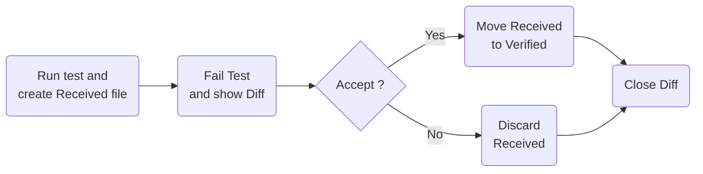
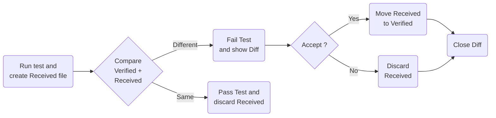

# Revitalizing Legacy Code
# Approval Testing Unleashed

#### Erfahrungen aus der Legacy-App-Portierung und 
#### Einblicke in die Welt von Verify

Patrick Drechsler

---

# Mein Hintergrund - soweit relevant

- Bevor ich IT gemacht habe:
  - Biomechanik / Bionik
  - vertraut mit Fluid-Dynamik und Rheologie
- Seit ich IT mache:
  - Domain-Driven Design (DDD)
  - Test-Driven Development (TDD)
  - Functional Programming (FP)

---

# Domain-Kontext

- Expertensystem
- User: Ingenieure im Vertrieb
- Besonderheiten:
  - SI-Einheiten
  - Fließkommazahlen
  - Mathematik
    - nicht nur Dreisatz
    - komplexe Formeln (inkl. Integralrechnung)
    - sehr viele Formeln (x * 10^3 LoC)
    - Mathematik ist Core-Domain!

---

# Tech-Stack(s)

- Main Stack: LAMP
  - Linux
  - Apache
  - MySQL
  - PHP
  - PLUS: Angular 1
- Other Stacks
  - C++
  - MATLAB

---

# Legacy Architecture

- FE: Angular
- BE: PHP
- Bonus: Weiteres externes System hat auch via BE & FE Daten abgerufen
  - Lassen wir erstmal außen vor

---

# Seam finden

- Was ist ein Seam? Working Effectively with Legacy Code
- PHP-Controller Anfrage nicht an PHP weiterleiten, sondern an eine neue Konsolenanwendung

```php
// Seam which toggles between PHP and .NET
if ($this->useDotNet) {
    // C# calculation (new)
    return $this->calcDotNet("calculate", $request);
}
else {
    // PHP calculation (legacy)
    return new CalcWithPhp($request);
}
```

---

# Code von PHP nach C# portieren

- sehr viel Tipparbeit
- sehr viel über Fließkommazahlen lernen
- Umstruktierung / Refactoring:
  - Ich war nicht einverstanden mit gewissen Entscheidungen im Altsystem (meiner Ansicht nach zuviel Vererbung, gefolgt von ganz viel if/else in abgeleiteten Klassen)
  - Jeder Produkttyp eine unabhängiger Typ ohne Vererbung (dafür viel Code-Duplizierung)
  - Stateless Konstrukte eingeführt
- hat 2-3 Monate gedauert
- in der Zeit "Blindflug"

---

# Portierten Code testen

- Vom Kunden hunderte realistische Beispiel-JSONs anfordern, bis die Code Coverage beim .NET Code bei fast 100% ist
- Durchs Alt-System jagen, Responses aufbewahren
- Durchs Neu-System jagen, Responses mit denen des Alt-Systems vergleichen

Wie geht das im Detail?

---

# Definitions

- Golden Master Test
- Approval Testing
- Verify
- Regression Test
- Acceptance Test
- Characterization Test (Martin Folwer)

We'll stick with Approval Testing and Verify for now.
And discuss the others later.

---

# Initial Workflow

- No existing `.verified.` file.



---

# Subsequent Workflow

- Existing `.verified.` file is compared with `.received.` file...




---

# Demo

```csharp
public record Person(string FirstName, string LastName, int Age);
```

```csharp
// Fact must return Task!
[Fact]
public Task HelloWorldTest()
{
    var homer = new Person("Homer", "Simpson", 39);
    return Verify(homer);
}
```

Verified text file:

```json
{
  FirstName: Homer,
  LastName: Simpson,
  Age: 39
}
```

---

# Verify - Randomness

No problem

- GUIDs (by default)
- TimeStamps (by default)
- Custom "Scrubbers"

---

# Demo

todo

---

# Verify - Floating Point Numbers

Floating point numbers are always a joy:

Especially when working with different programming languages and platforms.

(Yes, this is still a "problem" with .NET.)

- Custom tests for each platform
- Custom rounding

---

# Demo

todo

---

# Verify - JSON/XML

Order does not matter

- JSON/XML are parsed and compared with .NET standard libraries
- JSON/XML work out of the box

---

# Verify - Setup

- We can define the output folder
- We can define the file extension
- ...

---

# Verify - CI

- works out of the box
- No need to install anything on the CI server

---

# Verify - Diff-Tooling for Devs

- Visual Studio
- Rider
- Visual Studio Code
- OS
- CI-Flags / Logging

---

# Verify - F# Support

- Ploltly.NET (F#)
- works out of the box

