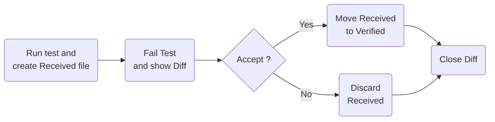
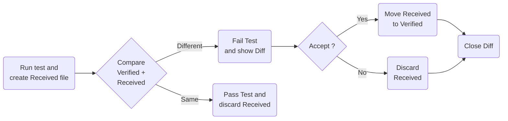

# Revitalizing Legacy Code
# Approval Testing Unleashed

#### Erfahrungen aus der Legacy-App-Portierung und 
#### Einblicke in die Welt von Verify

Patrick Drechsler

---

# Legacy-Context: Domain

- expert system
- user: engineers in sales
- Special features:
  - SI units
  - floating point numbers
  - mathematics
    - not just rule of three
    - complex formulas (including integral calculus)
    - a lot of formulas (x * 10^3 LoC)
    - mathematics is core domain!

---

# Legacy-Context: Tech-Stack(s)

- Main Stack: **LAMP**
  - **L**inux
  - **A**pache
  - **M**ySQL
  - **P**HP
  - ✨ Angular 1 (!) ✨
- Other Stacks
  - C++
  - MATLAB

---

# Legacy-Context: Architecture

- Frontend (FE): Angular 1
- Backend (BE): PHP
- Bonus: External system calls to FE & BE
  - Let's ignore this for now

---

# Find a "Seam"

- What is a Seam? 👉 M. Feathers "Working Effectively with Legacy Code"
- Example: Redirecting a php request to a new dotnet console application
  ```php
  // Seam which toggles between PHP and .NET
  if ($this->useDotNet) {
    // C# calculation (new)
    return $this->calcDotNet("calculate", $request);
  }
  else {
    // PHP calculation (legacy)
    return new CalcWithPhp($request);
  }
  ```
  ```php
  function calcDotNet($endpointName, Request $request)
  {
    // ...
    $encodedJson = base64_encode($request->getContent());
    $result = shell_exec("".$dotnetProgramm." ".$endpointName."  ".$encodedJson."");
    return $result;
  }
  ```

<style>
.slidev-code {
  font-size: 10px !important;
  line-height: 13px !important;
}
</style>

---

# Porting Code from PHP to C#

- a lot of typing (no AI usage)
- I learned a lot about floating point numbers
- Restructuring / Refactoring:
  - I disagreed with certain decisions in the old system (in my opinion too much inheritance, followed by a lot of if/else in derived classes)
  - 👉 I mapped each product type to an independent type without inheritance (a lot of code duplication)
  - 👉 I added "Stateless constructs": even more code duplication
- took 2-3 months
- no tests during that time

---

# Testing the Ported Code

- Get hundreds of realistic example JSONs from the customer
- Run through the old system, save responses
- Run through the new system, compare responses with saved responses
- Rinse and repeat until the code coverage of the new .NET code is close to 100%

How does that work in detail?

---

# Definitions

- Golden Master Test
- Approval Testing
- Verify
- Regression Test
- Acceptance Test
- Characterization Test

We'll stick with "Approval Testing" and "Verify" for now.
And discuss the others later.

---

# Initial Workflow

- No existing `.verified.` file.



---

# Subsequent Workflow

- Existing `.verified.` file is compared with `.received.` file...



---

# Hello World Example

```csharp
public record Person(string FirstName, string LastName, int Age);
```

```csharp
// ⚠️ Fact must return Task!
[Fact]
public Task VerifyPersonTest()
{
    var homer = new Person("Homer", "Simpson", 39);
    return Verify(homer);
}
```

Verified text file:

```json
{
  FirstName: Homer,
  LastName: Simpson,
  Age: 39
}
```

---
layout: two-cols-header
---

# Where is the Arrange-Act-Assert?

Let's add some logic.
TODO: fix css

::left::

```csharp
public record PersonRequest(string FirstName, string LastName, int Age);
public record PersonResponse(string FirstName, string LastName,int Age)
{
  public static PersonResponse FromRequest(PersonRequest request) =>
    new(request.FirstName, request.LastName,request.Age);
}
```

```csharp
[Fact]
public Task PersonRequest_homer_is_valid()
{
  // Arrange
  var now = DateTime.Now;
  var homer = new PersonRequest(
    "Homer",
    "Simpson",
    39,
    Guid.NewGuid(),
    now,
    now);

  // Act
  var actual = PersonResponse.FromRequest(homer);
  
  // Assert
  return Verify(actual);
```

::right:: 

Verified text file:

```json
{
  FirstName: Homer,
  LastName: Simpson,
  Age: 39,
  Id: Guid_1,
  CreatedAt: DateTime_1,
  UpdatedAt: DateTime_1
}
```

<style>
.slidev-code {
  font-size: 8px !important;
  line-height: 10px !important;
}
</style>

---

# Verify - Randomness

No problem 👉 "Scrubbers"

- GUIDs (by default)
- TimeStamps (by default)

---
layout: two-cols
---

- TODO: fix slide layout (css) 

```csharp
public record Person(
    string FirstName,
    string LastName,
    int Age,
    Guid Id,              // 👈
    DateTime CreatedAt,   // 👈
    DateTime? UpdatedAt); // 👈
```

::right::

```csharp
[Fact]
public Task PersonTest()
{
    var now = DateTime.Now;
    var homer = new Person(
        "Homer",
        "Simpson",
        39,
        Guid.NewGuid(), // 👈
        now,            // 👈
        now);           // 👈

    return Verify(homer);
}
```

```json
{
  FirstName: Homer,
  LastName: Simpson,
  Age: 39,
  Id: Guid_1,            // 👈
  CreatedAt: DateTime_1, // 👈
  UpdatedAt: DateTime_1  // 👈
}
```

---

# Verify - Custom Scrubbers

https://github.com/VerifyTests/Verify/blob/main/docs/scrubbers.md

- Example when generating SVGs using Plotly.NET: Scrub all lines containing `#clip` followed by a word character
- `ScrubLinesWithReplace` and friends

```fsharp
// F#
let settings = VerifySettings ()
settings.ScrubLinesWithReplace (fun line ->
    System.Text.RegularExpressions.Regex.Replace(line, "#clip\w+", "#clipSCRUBBED"))
```
```csharp
// C# (unverified)
var settings = new VerifySettings();
settings.ScrubLinesWithReplace(line =>
    System.Text.RegularExpressions.Regex.Replace(line, "#clip\\w+", "#clipSCRUBBED"));
```
---

# Verify - Diff-Tooling for Devs

- Visual Studio / Windows
- Rider
- Visual Studio Code
- 1st class support for all major IDEs
- 1st class integration for all common diff tools

Very cool: customizable to your needs!

---

# Verify - Setup

- We can define the output folder, file extensions, etc.
- Example `ModuleInitializer` for global setup, defining the output folder:
  ```csharp
  using System.Runtime.CompilerServices;

  public static class ModuleInitializer
  {
    [ModuleInitializer]
    public static void Initialize() 
    {
      // To prevent cluttering the main folder, we will collect all verified snapshots in a dedicated folder.
      // For details, see: https://github.com/VerifyTests/Verify/blob/main/docs/naming.md#derivepathinfo
      DerivePathInfo(
      (_, projectDirectory, type, method) => new(
        directory: Path.Combine(projectDirectory, "VerifiedData"),
        typeName: type.Name,
        methodName: method.Name));
    }
  }
  ```
---

# Verify - CI

- works out of the box
- No need to install anything on the CI server
- Customizable to your needs

---

# Verify - JSON/XML

- JSON/XML are first-class citizens:
  - Instead of verifiying a string, you can verify a JSON/XML object:
  - `VerifyJson` instead of `Verify`
  - `VerifyXml` instead of `Verify`
  - These customized methods will fail fast if the input is not valid JSON/XML

---

# Verify - JSON/XML: Example

```csharp
string InvalidJson = """{ "FirstName": "Homer" """;

[Fact(Skip = "This does not fail fast, and will do a string comparison... and fail")]
public Task Invalid_json_demo1() =>
    Verify(InvalidJson);     // 👈 Verify, vs...

[Fact(Skip = "This fails fast, because the input is invalid JSON")]
public Task Invalid_json_demo2() =>
    VerifyJson(InvalidJson); // 👈 VerifyJson 😎
```

Error message from second test:

```csharp
Argon.JsonReaderException: Unexpected end of content while loading JObject
```

It does not try to compare the invalid JSON with the verified JSON.

So, if you know that you are working with JSON/XML, use `VerifyJson`/`VerifyXml`!

---

# Verify - Simplify Reading Test Data

```csharp
[Fact]
public Task Reading_from_file()
{
    var fileContent = GetFileContent("valid-demo1.xml");
    return VerifyXml(fileContent);
}

// This saves us the hassle from having to deal with file paths in the tests.
// No more marking the file as "Copy if newer" or "Copy always".
private static string GetFileContent(string filename)
{
    const string sampleFolder = "SampleData";
    var relative = CurrentFile.Relative(Path.Combine(sampleFolder, filename));
    var fileContent = File.ReadAllText(relative);
    return fileContent;
}
```


---

# Verify - Floating Point Numbers

- Floating point numbers are always a joy 😿
- Especially when working with different programming languages and platforms
- `dotnet` will produce different results depending on the platform (Windows, Linux, macOS)
  - [MathNet.Numerics](https://numerics.mathdotnet.com/) might produce different results...
  - probably a niche case, but be aware of it
  - CI and/or target platform might differ from your dev machine 🤔
  - possible solutions.. 👉

---

# Verify - Floating Point Numbers

Verify offers different strategies:

  - Custom rounding
    ```csharp
    VerifierSettings.AddExtraSettings(x => x.FloatPrecision = 8);
    ```
  - Custom tests for each platform (if above fails)
    ```csharp
    // ...
    settings.UniqueForOSPlatform()
    // ...
    ```
    Drawback:
    - works on Linux dev machine, CI pipeline, target platform
    - fails on Windows dev machine, until windows dev commits ☹️

---

# Verify - F# Support

- Example: Plotly.NET (F#)
- works out of the box

---

# Verify - An Example

- TODO: An example showing many features of Verify (incl. web-api)

---

# Verify - For all the languages!

Similar libraries exist for most programming languages.

Overview: https://github.com/approvals

<div style="display: inline">


</div>

<style>
img {
  width: 100px;
  height: 100px;
  margin-bottom: 10px;
  display: inline-block;
}
</style>

---

# Definitions - Revisited

- Synonyms:
  - ✅ Golden Master Test
  - ✅ Approval Test
  - ✅ Snapshot Test
  - ✅ Verification Test / Verify
- NOT a synonym for:
  - **Regression Test**
    - a test which is run to ensure that the code still works after a change
  - **Acceptance Test**
    - a test which is run to ensure that the code works as expected
  - **Characterization Test** (Martin Fowler)
    - a test which is run to understand the behavior of the code

---

# Summary

- Verify is a great tool when dealing with legacy code
- You must find a "seam" in the legacy code to inject the new code
- Once you found it, you can start porting the code and writing tests
- Try to keep the "testing the seam" loop as short as possible
- As always: tests should be automated (especially in CI)...
- You might still have to deal with the final output format (encoding, floating point numbers, etc.)